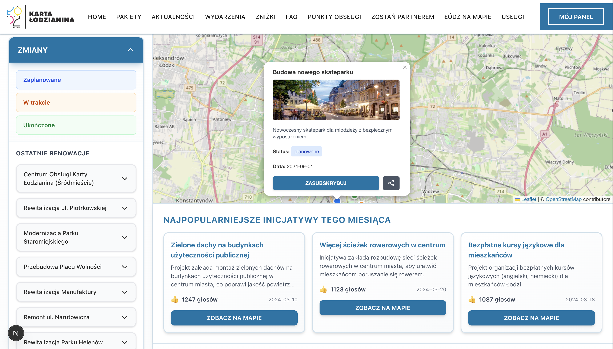
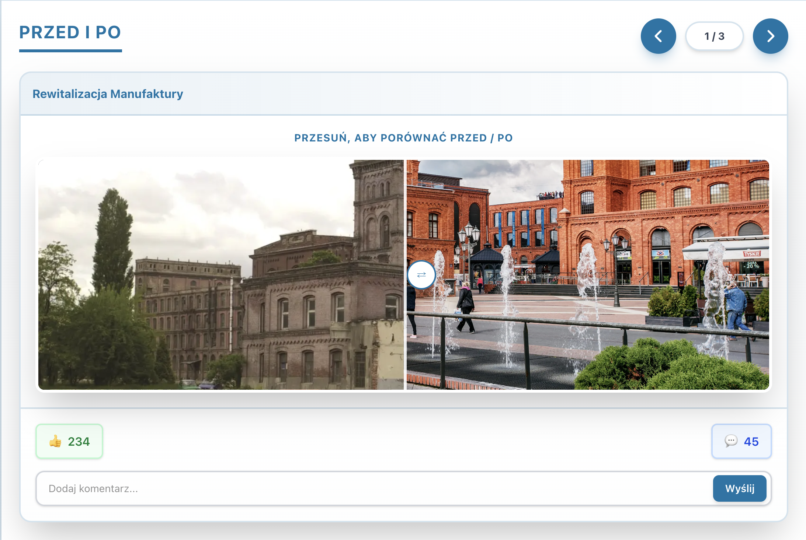
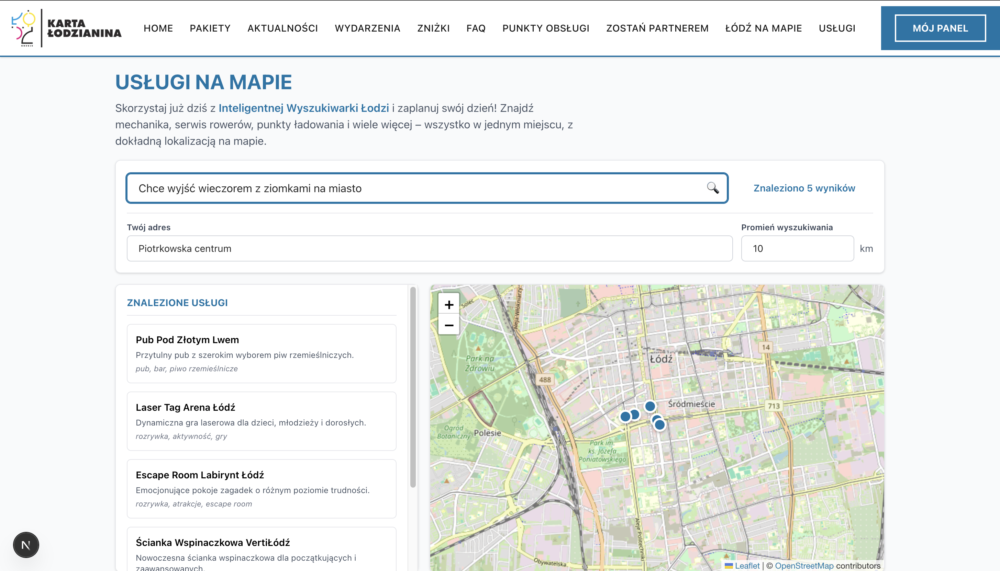

# BRIDGE

**by Dobre Chłopaki**

BRIDGE to prototyp rozszerzeń aplikacji **Karta Łodzianina**, zaprojektowany podczas hackathonu **Łódź_Hack**.  
Celem projektu jest przedstawienie nowoczesnego, interaktywnego sposobu:

* wizualizacji projektów miejskich,  
* inteligentnego wyszukiwania usług,  
* poprawy doświadczeń mieszkańców poprzez kontekstowe informacje i AI.

---

## Kluczowe Funkcje

### 1. „Łódź na mapie”: Interaktywna Wizualizacja Miasta

Naszym celem było stworzenie intuicyjnego sposobu prezentacji inwestycji miejskich.

**Co oferuje moduł:**

* Interaktywną **mapę miasta** (Leaflet + React-Leaflet)  
* Przejrzyście przedstawione **projekty miejskie**, podzielone według statusu:
  * 🟠 *Planowane*  
  * 🟡 *W trakcie* (z paskiem postępu)  
  * 🟢 *Gotowe*  
  * 🔵 *Inicjatywy społeczne* (z opcją głosowania)  
* **Filtrowanie** po statusach i kategoriach  
* Rozbudowane **karty projektów**, zawierające:
  * opis,  
  * daty realizacji,  
  * zdjęcia „przed / po”,  
  * szczegółowe informacje  
* Subtelne **animacje UX**, ułatwiające nawigację

  

---

### 2. Inteligentna wyszukiwarka usług (`/uslugi`)

Nowoczesna wyszukiwarka z AI, umożliwiająca mieszkańcom łatwe odnajdywanie usług w mieście.

**Najważniejsze możliwości:**

* **Semantyczne wyszukiwanie AI (Google Gemini)**  
* Obsługa naturalnych zapytań, np.:  
  > „Miejsce na spokojny wieczór z partnerem”
* **Personalizowane rekomendacje** usług  
* Wyniki prezentowane **na mapie**  
* **Filtrowanie lokalizacyjne**: adres + promień  
* Pełny katalog usług miejskich, w tym:
  * gastronomia,  
  * rozrywka (kina, escape roomy, wspinaczki),  
  * motoryzacja (mechanicy, ładowarki EV),  
  * zdrowie, edukacja,  
  * sport i rekreacja,  
  * coworking i biura  

---

## Technologia

### Stack technologiczny

* **Framework:** Next.js 16.0.6 (App Router)  
* **Język:** TypeScript 5  
* **UI:** React 19.2.0  
* **Styling:** Tailwind CSS 4  
* **Mapy:**  
  * Leaflet 1.9.4  
  * React-Leaflet 5.0.0  
* **Animacje:** Framer Motion 12.23.25  
* **AI / ML:** Google Generative AI – Gemini 2.5 Flash Lite
